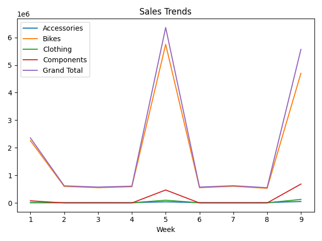

# pandas_vs_excel

Pandas是一个强大的分析结构化数据的工具集；它的使用基础是Numpy（提供高性能的矩阵运算）；用于数据挖掘和数据分析，同时也提供数据清洗功能。

利器之一：DataFrame
DataFrame是Pandas中的一个表格型的数据结构，包含有一组有序的列，每列可以是不同的值类型(数值、字符串、布尔型等)，DataFrame即有行索引也有列索引，可以被看做是由Series组成的字典。

利器之一：Series
它是一种类似于一维数组的对象，是由一组数据(各种NumPy数据类型)以及一组与之相关的数据标签(即索引)组成。仅由一组数据也可产生简单的Series对象。

### 安装模块
```bash
$ sudo pip3 install pandas
$ sudo pip3 install numpy
$ sudo pip3 install openpyxl
$ sudo pip3 install matplotlib
$ sudo pip3 install scipy
$ sudo pip3 install seaborn
$ sudo pip3 install python-dateutil
```

### 参考资料
```bash
https://pandas.pydata.org/
https://www.pypandas.cn/
```

### 创建文件
```python
import pandas as pd

# 定义DataFrame
df = pd.DataFrame(data={
    'ID': [1, 2, 3],
    'Name': ['dabolau', 'wangdan', 'lihong'],
})

# 设置ID为索引
df.set_index(keys='ID', inplace=True)

# 方式一，创建文件
# df.to_excel(excel_writer='001_output.xlsx')

# 方式二，创建文件
with pd.ExcelWriter(path='001_output.xlsx', engine='openpyxl') as xlsx:
    df.to_excel(excel_writer=xlsx)
```

> 表格内容（001_output.xlsx）

| ID   | Name    |
| ---- | ------- |
| 1    | dabolau |
| 2    | wangdan |
| 3    | lihong  |

### 读取文件

```python
import pandas as pd

# 方式一，读取文件
# df = pd.read_excel(
#     io='002_people.xlsx',
#     # header=None,  # 当没有列名时
#     index_col='ID',  # 获取数据时设置ID为索引
# )

# 方式二，读取文件
with pd.ExcelFile(io='002_people.xlsx', engine='openpyxl') as xlsx:
    df = pd.read_excel(
        io=xlsx,
        # header=None,  # 当没有列名时
        index_col='ID'  # 获取数据时设置ID为索引
    )

# 当没有列名时，设置所有列名
# df.columns = ['ID', 'Type', 'Title', 'FirstName', 'MiddleName', 'LastName']

# 常用方法
# print(df.shape)  # 获取矩阵维度
# print(df.index)  # 获取行索引
# print(df.columns)  # 获取列索引
# print(df.axes)  # 获取行和列索引
# print(df.T)  # 获取行和列位置对调
# print(df.info())  # 获取DataFrame对象的信息
print(df.head())  # 获取前5行数据
# print(df.tail())  # 获取后5行数据
```

> 表格内容（002_people.xlsx）

| ID   | Type     | Title | FirstName | MiddleName | LastName   |
| ---- | -------- | ----- | --------- | ---------- | ---------- |
| 1    | Employee | NULL  | Ken       | J          | Sánchez    |
| 2    | Employee | NULL  | Terri     | Lee        | Duffy      |
| 3    | Employee | NULL  | Roberto   | NULL       | Tamburello |
| 4    | Employee | NULL  | Rob       | NULL       | Walters    |
| 5    | Employee | Ms.   | Gail      | A          | Erickson   |

### 行、列、单元格

```python
import pandas as pd

# 方式一，创建序列
# d1 = {'x': 100, 'y': 200, 'z': 300}
# s1 = pd.Series(data=d1)
# print(s1)

# 方式二，创建序列
# d1 = [100, 200, 300]
# i1 = ['x', 'y', 'z']
# s1 = pd.Series(data=d1, index=i1)
# print(s1)

# 序列数据，当索引（index）不一致时，空白单元格会以NaN填充
s1 = pd.Series(data=[10, 20, 30], index=[1, 2, 3], name='A')
s2 = pd.Series(data=[100, 200, 300], index=[1, 2, 3], name='B')
s3 = pd.Series(data=[1000, 2000, 3000], index=[1, 2, 3], name='C')

# 以行的方式加入到数据框（DataFrame）当中
# df = pd.DataFrame(data=[s1, s2, s3])
# print(df)

# 以列的方式加入到数据框（DataFrame）当中
df = pd.DataFrame(data={s1.name: s1, s2.name: s2, s3.name: s3})
print(df)

# 创建文件
df.to_excel('003_output.xlsx')
```

> 表格内容（003_output.xlsx）行的形式

|      | 1    | 2    | 3    |
| ---- | ---- | ---- | ---- |
| A    | 10   | 20   | 30   |
| B    | 100  | 200  | 300  |
| C    | 1000 | 2000 | 3000 |

> 表格内容（003_output.xlsx）列的形式

|      | A    | B    | C    |
| ---- | ---- | ---- | ---- |
| 1    | 10   | 100  | 1000 |
| 2    | 20   | 200  | 2000 |
| 3    | 30   | 300  | 3000 |

### 内容区域读取、填充数据

```python
import pandas as pd
from datetime import date
from dateutil.relativedelta import relativedelta

# 读取文件
df = pd.read_excel(
    io='004_books.xlsx',
    skiprows=2,  # 跳过多少行读取数据
    usecols='B:E',  # 读取那些列的数据
    dtype={
        'ID': str,
        'InStore': str,
        'Date': str,
    },  # 设置数据类型
)

# 日期数据
dbDate = date(2023, 8, 26)

# 填充数据
for i in df.index:
    # # 序列（Series）方式填充内容
    # df['ID'].at[i] = i + 1
    # df['InStore'].at[i] = 'Yes' if i % 2 == 0 else 'No'
    # # df['Date'].at[i] = dbDate + relativedelta(days=i)  # 累加填充天数
    # # df['Date'].at[i] = dbDate + relativedelta(months=i)  # 累加填充月数
    # df['Date'].at[i] = dbDate + relativedelta(years=i)  #

    # 数据框（DataFrame）方式填充内容
    df.at[i, 'ID'] = i + 1
    df.at[i, 'InStore'] = 'Yes' if i % 2 == 0 else 'No'
    # df.at[i, 'Date'] = dbDate + relativedelta(days=i)  # 累加填充天数
    # df.at[i, 'Date'] = dbDate + relativedelta(months=i)  # 累加填充月数
    df.at[i, 'Date'] = dbDate + relativedelta(years=i)  # 累加填充年数

df.set_index('ID', inplace=True)  # 设置索引为（ID）并对原始对象进行修改
print(df)

# 创建文件
df.to_excel('004_books_output.xlsx')
```

> 表格内容（004_books.xlsx）上边空两行，左边空一列

|      |      |          |         |      |
| ---- | ---- | -------- | ------- | ---- |
|      |      |          |         |      |
|      | ID   | Name     | InStore | Date |
|      |      | Book_001 |         |      |
|      |      | Book_002 |         |      |
|      |      | Book_003 |         |      |
|      |      | Book_004 |         |      |
|      |      | Book_005 |         |      |
|      |      | Book_006 |         |      |
|      |      | Book_007 |         |      |
|      |      | Book_008 |         |      |
|      |      | Book_009 |         |      |

> 表格内容（004_books_output.xlsx）填充完成的表格内容

| ID   | Name     | InStore | Date       |
| ---- | -------- | ------- | ---------- |
| 1    | Book_001 | Yes     | 2023-08-26 |
| 2    | Book_002 | No      | 2024-08-26 |
| 3    | Book_003 | Yes     | 2025-08-26 |
| 4    | Book_004 | No      | 2026-08-26 |
| 5    | Book_005 | Yes     | 2027-08-26 |
| 6    | Book_006 | No      | 2028-08-26 |
| 7    | Book_007 | Yes     | 2029-08-26 |
| 8    | Book_008 | No      | 2030-08-26 |
| 9    | Book_009 | Yes     | 2031-08-26 |

### 函数填充，计算列

```python
import pandas as pd


# 加法运算
def addNumber(number):
    return number + 2


# 读取文件
df = pd.read_excel(
    io='006_books.xlsx',
    index_col='ID'  # 设置索引为（ID）
)

# 方式一，以一列乘一列的方式填充数据
# df['Price'] = df['ListPrice'] * df['Discount']

# 方式二，以单元格的形式填充数据
for i in df.index:
    df['Price'].at[i] = df['ListPrice'].at[i] * df['Discount'].at[i]

# 给列增加填充数据
# df['ListPrice'] = df['ListPrice'] + 2

# 给列增加数据填充的高级用法
df['ListPrice'] = df['ListPrice'].apply(addNumber)

print(df)

# 创建文件
df.to_excel('006_books_output.xlsx')
```

> 表格内容（006_books.xlsx）

| ID   | Name     | ListPrice | Discount | Price |
| ---- | -------- | --------- | -------- | ----- |
| 1    | Book_001 | 10        | 0.5      |       |
| 2    | Book_002 | 20        | 0.5      |       |
| 3    | Book_003 | 30        | 0.5      |       |
| 4    | Book_004 | 40        | 0.5      |       |
| 5    | Book_005 | 50        | 0.5      |       |
| 6    | Book_006 | 60        | 0.5      |       |
| 7    | Book_007 | 70        | 0.5      |       |
| 8    | Book_008 | 80        | 0.5      |       |
| 9    | Book_009 | 90        | 0.5      |       |

> 表格内容（006_books_output.xlsx）先计算出Price列的值，再让ListPrice列的值自增2

| ID   | Name     | ListPrice | Discount | Price |
| ---- | -------- | --------- | -------- | ----- |
| 1    | Book_001 | 12        | 0.5      | 5     |
| 2    | Book_002 | 22        | 0.5      | 10    |
| 3    | Book_003 | 32        | 0.5      | 15    |
| 4    | Book_004 | 42        | 0.5      | 20    |
| 5    | Book_005 | 52        | 0.5      | 25    |
| 6    | Book_006 | 62        | 0.5      | 30    |
| 7    | Book_007 | 72        | 0.5      | 35    |
| 8    | Book_008 | 82        | 0.5      | 40    |
| 9    | Book_009 | 92        | 0.5      | 45    |

### 排序，多重排序

```python
import pandas as pd

# 读取文件
df = pd.read_excel(
    io='007_list.xlsx',
    index_col='ID'  # 设置索引为（ID）
)

# 排序
# df.sort_values(
#     by='Price',
#     inplace=True,  # 对原始对象进行修改
#     ascending=False,  # 默认为升序排序（True），降序排序（False）
# )

# 多重排序
df.sort_values(
    by=['Worthy', 'Price'],
    inplace=True,  # 对原始对象进行修改
    ascending=[True, False],  # 默认为升序排序（True），降序排序（False）
)

print(df)

# 创建文件
df.to_excel('007_list_output.xlsx')
```

> 表格内容（007_list.xlsx）

| ID   | Name        | Price | Worthy |
| ---- | ----------- | ----- | ------ |
| 1    | Product_001 | 9.82  | Yes    |
| 2    | Product_002 | 11.99 | Yes    |
| 3    | Product_003 | 9.62  | No     |
| 4    | Product_004 | 11.08 | Yes    |
| 5    | Product_005 | 7.75  | Yes    |
| 6    | Product_006 | 7.34  | No     |
| 7    | Product_007 | 10.97 | Yes    |
| 8    | Product_008 | 11.14 | Yes    |
| 9    | Product_009 | 8.98  | No     |

> 表格内容（007_list_output.xlsx）通过Worthy升序和Price降序排序后的数据

| ID   | Name        | Price | Worthy |
| ---- | ----------- | ----- | ------ |
| 3    | Product_003 | 9.62  | No     |
| 9    | Product_009 | 8.98  | No     |
| 6    | Product_006 | 7.34  | No     |
| 2    | Product_002 | 11.99 | Yes    |
| 8    | Product_008 | 11.14 | Yes    |
| 4    | Product_004 | 11.08 | Yes    |
| 7    | Product_007 | 10.97 | Yes    |
| 1    | Product_001 | 9.82  | Yes    |
| 5    | Product_005 | 7.75  | Yes    |

### 数据筛选、过滤

```python
import pandas as pd


# 年龄大于等于18小于等于30岁的学生
def age18To30(age):
    return age >= 18 and age <= 30


# 分数大于等于85小于等于100分的学生
def score85To100(score):
    return score >= 85 and score <= 100


# 读取文件
df = pd.read_excel(
    io='008_students.xlsx',
    index_col='ID'  # 设置索引为（ID）
)

# 条件筛选过滤
df = df.loc[df['Age'].apply(age18To30)]
# 多条件筛选过滤
df = df.loc[df['Age'].apply(age18To30) & df['Score'].apply(score85To100)]

print(df)

# 创建文件
df.to_excel('008_students_output.xlsx')
```

> 表格内容（008_students.xlsx）

| ID   | Name        | Age  | Score |
| ---- | ----------- | ---- | ----- |
| 1    | Student_001 | 16   | 87    |
| 2    | Student_002 | 26   | 92    |
| 3    | Student_003 | 33   | 100   |
| 4    | Student_004 | 27   | 73    |
| 5    | Student_005 | 32   | 63    |
| 6    | Student_006 | 20   | 93    |
| 7    | Student_007 | 19   | 55    |
| 8    | Student_008 | 21   | 61    |
| 9    | Student_009 | 18   | 85    |

> 表格内容（008_students_output.xlsx）通过Age大于等于18岁小于等于30岁和Score大于等于85分进行筛选过滤后的数据

| ID   | Name        | Age  | Score |
| ---- | ----------- | ---- | ----- |
| 2    | Student_002 | 26   | 92    |
| 6    | Student_006 | 20   | 93    |
| 9    | Student_009 | 18   | 85    |

### 柱状图

```python
import pandas as pd
from matplotlib import pyplot as plt

# 读取文件
df = pd.read_excel(io='009_students.xlsx')

# 排序
df.sort_values(
    by='Number',
    inplace=True,  # 对原始对象进行修改
    ascending=False,  # 默认为升序排序（True），降序排序（False）
)

print(df)

# 柱状图（pandas）
# df.plot.bar(
#     x='Field',  # 设置x轴数据
#     y='Number',  # 设置y轴数据
#     color='orange',  # 设置颜色
#     title='International Students by Field',  # 设置标题
# )
# plt.tight_layout()  # 设置为紧凑布局
# plt.show()  # 显示图表

# 柱状图（matplotlib.pyplot）
plt.bar(
    df['Field'],  # 设置x轴数据
    df['Number'],  # 设置y轴数据
    color='orange',  # 设置颜色
    width=0.7,  # 宽度
)
# 将x轴的数据名字旋转90度
plt.xticks(df['Field'], rotation=90)
# 设置x轴的标签
plt.xlabel('Field')
# 设置y轴的标签
plt.ylabel('Number')
# 设置标题
plt.title('International Students by Field', fontsize=16)

plt.tight_layout()  # 设置为紧凑布局
plt.show()  # 显示图表
```

> 表格内容（009_students.xlsx）

| Field                             | Number  |
| --------------------------------- | ------- |
| Agriculture                       | 12,318  |
| Business and Management           | 200,312 |
| Education                         | 19,483  |
| Engineering                       | 216,932 |
| Fine and Applied Arts             | 59,736  |
| Health Professions                | 33,947  |
| Humanities                        | 17,664  |
| Mathematics and Computer Sciences | 141,651 |
| Other/Unspecified Subject Areas   | 185,107 |

> 图片（柱状图）通过Number降序排序后生成的图表


### 并列柱状图

```python
import numpy as np
import pandas as pd
from matplotlib import pyplot as plt

# # 读取文件
df = pd.read_excel(io='010_students.xlsx')

# 排序
df.sort_values(
    by='2017',
    inplace=True,  # 对原始对象进行修改
    ascending=False,  # 默认为升序排序（True），降序排序（False）
)

print(df)

# 并列柱状图（pandas）
# df.plot.bar(
#     x='Field',  # 设置x轴数据
#     y=['2016', '2017'],  # 设置y轴数据
#     color=['orange', 'red'],  # 设置颜色
#     title='International Students by Field',  # 设置标题
# )
# plt.tight_layout()  # 设置为紧凑布局
# plt.show()  # 显示图表

# 并列柱状图（matplotlib.pyplot）
x = np.arange(len(df))  # 获取数据框中的数据条数
totalWidth = 0.8  # 并列柱状图总宽度
numberOfGroups = 2  # 并列柱状图分组数，有多少个plt.bar()就填多少个分组
width = totalWidth / numberOfGroups  # 单个柱状图的宽度

# 并列柱状图，1
plt.bar(
    x=x + width * 0,  # 设置x轴数据，设置为第几个分组
    height=df['2016'],  # 设置y轴数据
    color='orange',  # 设置颜色
    width=width,  # 设置宽度
    label=df['2016'].name,  # 设置标签
)
# 并列柱状图，2
plt.bar(
    x=x + width * 1,  # 设置x轴数据，设置为第几个分组
    height=df['2017'],  # 设置y轴数据
    color='red',  # 设置颜色
    width=width,  # 设置宽度
    label=df['2017'].name,  # 设置标签
)

# 将x轴的数据名字旋转90度
plt.xticks(ticks=x, labels=df['Field'], rotation=90)
# 设置x轴的标签
plt.xlabel('Field')
# 设置y轴的标签
plt.ylabel('Number')
# 设置标题
plt.title('International Students by Field', fontsize=16)

plt.tight_layout()  # 设置为紧凑布局
plt.legend()  # 显示标签
plt.show()  # 显示图表
```

> 表格内容（010_students.xlsx）

| **Field**                         | **2016** | **2017** |
| --------------------------------- | -------- | -------- |
| Agriculture                       | 12,318   | 12,602   |
| Business and Management           | 200,312  | 200,754  |
| Communications and Journalism     | 21,160   | 21,913   |
| Education                         | 19,483   | 17,993   |
| Engineering                       | 216,932  | 230,711  |
| Fine and Applied Arts             | 59,736   | 61,506   |
| Humanities                        | 17,664   | 17,561   |
| Intensive English                 | 40,877   | 30,309   |
| Legal Studies and Law Enforcement | 15,077   | 15,306   |

> 图片（并列柱状图）通过2017降序排序后生成的图表


### 堆积柱状图、水平堆积柱状图

```python
import pandas as pd
from matplotlib import pyplot as plt

# 读取文件
df = pd.read_excel(io='011_users.xlsx')

# 添加合计列
df['Total'] = df['Oct'] + df['Nov'] + df['Dec']

# 排序
df.sort_values(
    by='Total',
    inplace=True,  # 对原始对象进行修改
    ascending=False,  # 默认为升序排序（True），降序排序（False）
)

print(df)

# 堆积柱状图（pandas），水平堆积柱状图只需将bar改为barh
# df.plot.bar(
#     x='Name',  # 设置x轴数据
#     y=['Oct', 'Nov', 'Dec'],  # 设置y轴数据
#     color=['orange', 'red', 'pink'],  # 设置颜色
#     stacked=True,  # 设置堆积
#     title='User Behavior',  # 设置标题
# )
# plt.tight_layout()  # 设置为紧凑布局
# plt.show()  # 显示图表

# 堆积柱状图（matplotlib.pyplot）
width = 0.8  # 柱状图的宽度

# 柱状图，1
plt.bar(
    x=df['Name'],  # 设置x轴数据
    height=df['Oct'],  # 设置y轴数据
    color='orange',  # 设置颜色
    width=width,  # 设置宽度
    label=df['Oct'].name,  # 设置标签
)
# 柱状图，2
plt.bar(
    x=df['Name'],  # 设置x轴数据
    height=df['Nov'],  # 设置y轴数据
    color='red',  # 设置颜色
    width=width,  # 设置宽度
    label=df['Nov'].name,  # 设置标签
    bottom=df['Oct'],  # 将数据堆积到其他数据的上面
)
# 柱状图，3
plt.bar(
    x=df['Name'],  # 设置x轴数据
    height=df['Dec'],  # 设置y轴数据
    color='pink',  # 设置颜色
    width=width,  # 设置宽度
    label=df['Dec'].name,  # 设置标签
    bottom=df['Oct'] + df['Nov'],  # 将数据堆积到其他数据的上面
)

# 将x轴的数据名字旋转90度
plt.xticks(ticks=df['Name'], rotation=90)
# 设置x轴的标签
plt.xlabel('Name')
# 设置y轴的标签
plt.ylabel('Total')
# 设置标题
plt.title('User Behavior', fontsize=16)

plt.tight_layout()  # 设置为紧凑布局
plt.legend()  # 显示标签
plt.show()  # 显示图表

```

> 表格内容（011_users.xlsx）

| **ID** | **Name** | **Oct** | **Nov** | **Dec** |
| ------ | -------- | ------- | ------- | ------- |
| **1**  | User_001 | 7       | 15      | 10      |
| **2**  | User_002 | 10      | 13      | 10      |
| **3**  | User_003 | 12      | 10      | 17      |
| **4**  | User_004 | 8       | 14      | 13      |
| **5**  | User_005 | 8       | 11      | 16      |
| **6**  | User_006 | 11      | 9       | 14      |
| **7**  | User_007 | 11      | 14      | 17      |
| **8**  | User_008 | 9       | 12      | 16      |
| **9**  | User_009 | 11      | 11      | 15      |

> 图片（堆积柱状图）通过新增累加计算Total列后降序排序生成图表


### 饼状图

```python
import pandas as pd
from matplotlib import pyplot as plt

# 读取文件
df = pd.read_excel(
    io='012_students.xlsx',
    index_col='From',  # 设置索引
)

df.sort_values(
    by='2017',
    inplace=True,  # 对原始对象进行修改
    ascending=True,  # 默认为升序排序（True），降序排序（False） 
)

print(df)

# 饼状图（pandas）
# df['2017'].plot.pie(
#     title='Source of International Students',
#     startangle=-270,  # 摆放角度)
# )
# plt.tight_layout()  # 设置为紧凑布局
# plt.show()  # 显示图表

# 饼状图（matplotlib.pyplot）
plt.pie(
    df['2017'],
    labels=df.index,  # 设置标签
    startangle=-270,  # 摆放角度
    autopct='%3.2f%%',  # 显示百分比
)

# 设置标题
plt.title('Source of International Students', fontsize=16)

plt.tight_layout()  # 设置为紧凑布局
# plt.legend()  # 显示标签
plt.show()  # 显示图表
```

> 表格内容（012_students.xlsx）

| **Rank** | **From**     | **2016** | **2017** |
| -------- | ------------ | -------- | -------- |
| **1**    | China        | 328,547  | 350,755  |
| **2**    | India        | 165,918  | 186,267  |
| **3**    | South Korea  | 61,007   | 58,663   |
| **4**    | Saudi Arabia | 61,287   | 52,611   |
| **5**    | Canada       | 26,973   | 27,065   |
| **6**    | Vietnam      | 21,403   | 22,438   |
| **7**    | Taiwan       | 21,127   | 21,516   |
| **8**    | Japan        | 19,060   | 18,780   |
| **9**    | Mexico       | 16,733   | 16,835   |

> 图片（饼状图）


### 折线图、面积图

```python
import pandas as pd
from matplotlib import pyplot as plt

# 读取文件
df = pd.read_excel(
    io='013_orders.xlsx',
    index_col='Week',  # 设置索引
)

print(df)

# 折线图（pandas）
# df.plot(
#     y=df.columns,
#     title='Sales Trends',  # 设置标题
# )

# 面积图（pandas）
df.plot.area(
    y=df.columns,
    title='Sales Trends',  # 设置标题
)

plt.tight_layout()  # 设置为紧凑布局
plt.show()  # 显示图表

```

> 表格内容（013_orders.xlsx）

| **Week** | **Accessories**  | **Bikes**        | **Clothing**     | **Components**   | **Grand Total**  |
| -------- | ---------------- | ---------------- | ---------------- | ---------------- | ---------------- |
| **1**    | 9939.46549999993 | 2258336.63560001 | 9641.47605799998 | 78721.0951       | 2356638.67225801 |
| **2**    | 12626.6599999999 | 600535.007799998 | 7261.72999999997 | 0                | 620423.397799998 |
| **3**    | 14414.9499999999 | 554770.827099998 | 6775.77999999997 | 0                | 575961.557099998 |
| **4**    | 12924.5799999999 | 589255.708799998 | 6191.36999999998 | 0                | 608371.658799998 |
| **5**    | 40443.4985159994 | 5749221.81311502 | 99474.5982260006 | 470901.449199999 | 6360041.35905702 |
| **6**    | 13735.4599999999 | 553942.296499998 | 7660.72999999997 | 0                | 575338.486499998 |
| **7**    | 13588.7999999999 | 605384.749199998 | 5786.00999999998 | 0                | 624759.559199998 |
| **8**    | 13997.8099999999 | 532005.626299998 | 6690.36999999998 | 0                | 552693.806299998 |
| **9**    | 52392.2632040003 | 4701388.83795402 | 128208.010272    | 685202.2595      | 5567191.37093002 |

> 图片（折线图）



### 散点图、直方图、密度图，数据相关性

```python
import pandas as pd
from matplotlib import pyplot as plt

# 读取文件
df = pd.read_excel(io='014_homes.xlsx', )

print(df)

# 数据相关性
print(df.corr())

# 散点图（pandas）
# df.plot.scatter(
#     x='sqft_living',
#     y='price',
#     title='Sales Trends',  # 设置标题
# )

# 直方图（pandas）
# df['sqft_living'].plot.hist(
#     title='Sales Trends',  # 设置标题
# )

# 密度图（pandas）
df['sqft_living'].plot.kde(
    title='Sales Trends',  # 设置标题
)

plt.tight_layout()  # 设置为紧凑布局
plt.show()  # 显示图表
```

> 表格内容（014_homes.xlsx）

| **id**         | **price** | **bedrooms** | **bathrooms** | **sqft_living** | **sqft_basement** | **sqft_lot** | **floors** | **yr_built** |
| -------------- | --------- | ------------ | ------------- | --------------- | ----------------- | ------------ | ---------- | ------------ |
| **7129300520** | 221900    | 3            | 1             | 1180            | 0                 | 5650         | 1          | 1955         |
| **6414100192** | 538000    | 3            | 2.25          | 2570            | 400               | 7242         | 2          | 1951         |
| **5631500400** | 180000    | 2            | 1             | 770             | 0                 | 10000        | 1          | 1933         |
| **2487200875** | 604000    | 4            | 3             | 1960            | 910               | 5000         | 1          | 1965         |
| **1954400510** | 510000    | 3            | 2             | 1680            | 0                 | 8080         | 1          | 1987         |
| **7237550310** | 1225000   | 4            | 4.5           | 5420            | 1530              | 101930       | 1          | 2001         |
| **1321400060** | 257500    | 3            | 2.25          | 1715            | 0                 | 6819         | 2          | 1995         |
| **2008000270** | 291850    | 3            | 1.5           | 1060            | 0                 | 9711         | 1          | 1963         |

> 表格内容（014_homes_output.xlsx）数据相关性

|                   | **id**             | **price**          | **bedrooms**       | **bathrooms**     | **sqft_living**   | **sqft_basement**  | **sqft_lot**      | **floors**         | **yr_built**       |
| ----------------- | ------------------ | ------------------ | ------------------ | ----------------- | ----------------- | ------------------ | ----------------- | ------------------ | ------------------ |
| **id**            | 1                  | 0.323889798725798  | -0.015661236743502 | 0.113171790861151 | 0.421072803333328 | 0.365474183613887  | 0.463868747671062 | -0.097786107725464 | -0.308722452733228 |
| **price**         | 0.323889798725798  | 1                  | 0.764100666197396  | 0.941415151374362 | 0.959974234811683 | 0.930082713543318  | 0.871527847414277 | -0.146017401318073 | 0.57835388020905   |
| **bedrooms**      | -0.015661236743502 | 0.764100666197396  | 1                  | 0.832050294337844 | 0.689300693613315 | 0.807176067808162  | 0.517574777786751 | -0.120385853085769 | 0.607429234757069  |
| **bathrooms**     | 0.113171790861151  | 0.941415151374362  | 0.832050294337844  | 1                 | 0.924116736942091 | 0.923934993560881  | 0.791027993943616 | 0.033389028164709  | 0.688959363062322  |
| **sqft_living**   | 0.421072803333328  | 0.959974234811683  | 0.689300693613315  | 0.924116736942091 | 1                 | 0.890296863889176  | 0.911885515019121 | 0.041019601627936  | 0.605937837435407  |
| **sqft_basement** | 0.365474183613887  | 0.930082713543318  | 0.807176067808162  | 0.923934993560881 | 0.890296863889176 | 1                  | 0.805751571038046 | -0.166148799024286 | 0.408592146877422  |
| **sqft_lot**      | 0.463868747671062  | 0.871527847414277  | 0.517574777786751  | 0.791027993943616 | 0.911885515019121 | 0.805751571038046  | 1                 | -0.22658836934617  | 0.539223415518102  |
| **floors**        | -0.097786107725464 | -0.146017401318073 | -0.120385853085769 | 0.033389028164709 | 0.041019601627936 | -0.166148799024286 | -0.22658836934617 | 1                  | 0.111253780804074  |
| **yr_built**      | -0.308722452733228 | 0.57835388020905   | 0.607429234757069  | 0.688959363062322 | 0.605937837435407 | 0.408592146877422  | 0.539223415518102 | 0.111253780804074  | 1                  |

### 多表联合

```python
import pandas as pd

# 读取文件
Students = pd.read_excel(
    io='016_student_score.xlsx',
    sheet_name='Students',  # 工作表
    index_col='ID',  # 设置索引
)
Scores = pd.read_excel(
    io='016_student_score.xlsx',
    sheet_name='Scores',  # 工作表
    index_col='ID',  # 设置索引
)

print(Students)
print(Scores)

# 方法一，将Scores合并到Students表的右边
# StudentsAndScores = Students.merge(
#     Scores,
#     how='left',  # 保留Students表中的ID列的所有值
#     on='ID',  # 以ID列的值进行合并，当表1表2用不同列进行合并时请用left_on或right_on代替
# )

# 方法二，将Scores合并到Students表的右边
StudentsAndScores = Students.join(
    Scores,
    how='left',  # 保留Students表中的ID列的所有值
)

# 填充NaN为0
StudentsAndScores = StudentsAndScores.fillna(0)
# 修改Score列类型为整数型
StudentsAndScores['Score'] = StudentsAndScores['Score'].astype(int)

print(StudentsAndScores)
```

> 表格内容（016_student_score.xlsx）sheet_name=Students

| ID   | Name        |
| ---- | ----------- |
| 1    | Student_001 |
| 3    | Student_003 |
| 5    | Student_005 |
| 7    | Student_007 |
| 9    | Student_009 |
| 11   | Student_011 |
| 13   | Student_013 |
| 15   | Student_015 |
| 17   | Student_017 |

> 表格内容（016_student_score.xlsx）sheet_name=Scores

| ID   | Score |
| ---- | ----- |
| 1    | 81    |
| 2    | 82    |
| 3    | 83    |
| 4    | 84    |
| 5    | 85    |
| 6    | 86    |
| 7    | 87    |
| 8    | 88    |
| 9    | 89    |

> 表格内容（016_student_score_output.xlsx）合并Students和Scores工作表

| ID   | Name        | Score |
| ---- | ----------- | ----- |
| 1    | Student_001 | 81    |
| 3    | Student_003 | 83    |
| 5    | Student_005 | 85    |
| 7    | Student_007 | 87    |
| 9    | Student_009 | 89    |
| 11   | Student_011 | 0     |
| 13   | Student_013 | 0     |
| 15   | Student_015 | 0     |
| 17   | Student_017 | 0     |

### 数据校验与轴的概念

```python
import pandas as pd


# 分数校验
def score0To100(score):
    if score['Score'] <= 0 or score['Score'] >= 100:
        print('{}\t{}\t{}\t数据校验不通过'.format(score['ID'], score['Name'],
                                           score['Score']))


# 读取文件
df = pd.read_excel(io='017_students.xlsx')

print(df)

# DataFrame中有两个轴0和1，0表示从上到下，1表示从左到右
df.apply(
    score0To100,
    axis=1,  # 0表示从上到下，1表示从左到右
)
```

> 表格内容（017_students.xlsx）

| ID   | Name        | Score |
| ---- | ----------- | ----- |
| 1    | Student_001 | -10   |
| 2    | Student_002 | 0     |
| 3    | Student_003 | 10    |
| 4    | Student_004 | 20    |
| 5    | Student_005 | 30    |
| 6    | Student_006 | 80    |
| 7    | Student_007 | 90    |
| 8    | Student_008 | 100   |
| 9    | Student_009 | 110   |

### 把一列数据分割成两列数据

```python
import pandas as pd

# 读取文件
df = pd.read_excel(
    io='018_mployees.xlsx',
    index_col='ID',  # 设置索引
)

print(df)

# 参考资料 https://pandas.pydata.org/pandas-docs/stable/reference/series.html
# 分割数据
df_split = df['Full Name'].str.split(expand=True)

print(df_split)

# 添加两列
df['First Name'] = df_split[0]
df['Last Name'] = df_split[1]

print(df)

# 创建文件
df.to_excel('018_mployees_output.xlsx')
```

> 表格内容（018_mployees.xlsx）

| ID   | Full Name        |
| ---- | ---------------- |
| 1    | Syed Abbas       |
| 2    | Catherine Abel   |
| 3    | Kim Abercrombie  |
| 4    | Kim Abercrombie  |
| 5    | Kim Abercrombie  |
| 6    | Hazem Abolrous   |
| 7    | Sam Abolrous     |
| 8    | Humberto Acevedo |
| 9    | Gustavo Achong   |

> 表格内容（018_mployees_output.xlsx）

| ID   | Full Name        | First Name | Last Name   |
| ---- | ---------------- | ---------- | ----------- |
| 1    | Syed Abbas       | Syed       | Abbas       |
| 2    | Catherine Abel   | Catherine  | Abel        |
| 3    | Kim Abercrombie  | Kim        | Abercrombie |
| 4    | Kim Abercrombie  | Kim        | Abercrombie |
| 5    | Kim Abercrombie  | Kim        | Abercrombie |
| 6    | Hazem Abolrous   | Hazem      | Abolrous    |
| 7    | Sam Abolrous     | Sam        | Abolrous    |
| 8    | Humberto Acevedo | Humberto   | Acevedo     |
| 9    | Gustavo Achong   | Gustavo    | Achong      |

### 求和，求平均，统计引导

```python
import pandas as pd

# 读取文件
df = pd.read_excel(
    io='019_students.xlsx',
    index_col='ID',  # 设置索引
)

print(df)

# 参考资料 https://pandas.pydata.org/docs/reference/frame.html
# DataFrame中有两个轴列（0）和行（1），axis=0表示列，axis=1表示行
rowSum = df[['Test_1', 'Test_2', 'Test_3']].sum(axis=1)  # sum 按行求和
rowMean = df[['Test_1', 'Test_2', 'Test_3']].mean(axis=1)  # Mean 按行求平均

print(rowSum)
print(rowMean)

# 添加两列
df['Total'] = rowSum
df['Average'] = rowMean

print(df)

colMean = df[['Test_1', 'Test_2', 'Test_3', 'Total',
              'Average']].mean()  # Mean 按列求平均
colMean['Name'] = 'Summary'

print(colMean)

# 添加一行
df = df.append(
    colMean,
    ignore_index=True,  # 忽略索引
)

print(df)

# 创建文件
df.to_excel('019_students_output.xlsx')
```

> 表格内容（019_students.xlsx）

| ID   | Name        | Test_1 | Test_2 | Test_3 |
| ---- | ----------- | ------ | ------ | ------ |
| 1    | Student_001 | 62     | 86     | 83     |
| 2    | Student_002 | 77     | 97     | 78     |
| 3    | Student_003 | 57     | 96     | 46     |
| 4    | Student_004 | 57     | 87     | 80     |
| 5    | Student_005 | 95     | 59     | 87     |
| 6    | Student_006 | 56     | 97     | 61     |
| 7    | Student_007 | 64     | 91     | 67     |
| 8    | Student_008 | 96     | 70     | 48     |
| 9    | Student_009 | 77     | 73     | 48     |

> 表格内容（019_students_output.xlsx）

|      | Name        | Test_1      | Test_2 | Test_3      | Total       | Average     |
| ---- | ----------- | ----------- | ------ | ----------- | ----------- | ----------- |
| 0    | Student_001 | 62          | 86     | 83          | 231         | 77          |
| 1    | Student_002 | 77          | 97     | 78          | 252         | 84          |
| 2    | Student_003 | 57          | 96     | 46          | 199         | 66.33333333 |
| 3    | Student_004 | 57          | 87     | 80          | 224         | 74.66666667 |
| 4    | Student_005 | 95          | 59     | 87          | 241         | 80.33333333 |
| 5    | Student_006 | 56          | 97     | 61          | 214         | 71.33333333 |
| 6    | Student_007 | 64          | 91     | 67          | 222         | 74          |
| 7    | Student_008 | 96          | 70     | 48          | 214         | 71.33333333 |
| 8    | Student_009 | 77          | 73     | 48          | 198         | 66          |
| 9    | Summary     | 71.22222222 | 84     | 66.44444444 | 221.6666667 | 73.88888889 |

### 定位、消除重复数据

```python
import pandas as pd

# 读取文件
df = pd.read_excel(io='020_students_duplicates.xlsx', )

print(df)

# # 消除重复数据
# df.drop_duplicates(
#     subset='Name',  # 消除单列重复数据subset='Name'，消除多列重复数据subset=['ID','Name']
#     inplace=True,  # 对原始对象进行修改
#     keep='first',  # 保留前面的重复数据keep='first'，保留后面的重复数据keep='last'
# )

# print(df)

# # 创建文件
# df.to_excel('020_students_duplicates_output1.xlsx')

# 获取重复数据
temp = df.duplicated(subset='Name')
# 如果是重复数据Series就为True，这时取出为True的数据就是获取到重复的数据
df = df[temp == True]

print(df)

# 创建文件
df.to_excel('020_students_duplicates_output2.xlsx')
```

> 表格内容（020_students_duplicates.xlsx）

| ID   | Name        | Test_1 | Test_2 | Test_3 |
| ---- | ----------- | ------ | ------ | ------ |
| 1    | Student_001 | 62     | 86     | 83     |
| 2    | Student_002 | 77     | 97     | 78     |
| 3    | Student_003 | 56     | 97     | 61     |
| 4    | Student_004 | 64     | 91     | 67     |
| 5    | Student_005 | 96     | 70     | 48     |
| 6    | Student_006 | 77     | 73     | 48     |
| 7    | Student_007 | 90     | 94     | 67     |
| 8    | Student_001 | 62     | 86     | 83     |
| 9    | Student_002 | 77     | 97     | 78     |

> 表格内容（020_students_duplicates_output1.xlsx）消除重复数据

|      | ID   | Name        | Test_1 | Test_2 | Test_3 |
| ---- | ---- | ----------- | ------ | ------ | ------ |
| 0    | 1    | Student_001 | 62     | 86     | 83     |
| 1    | 2    | Student_002 | 77     | 97     | 78     |
| 2    | 3    | Student_003 | 56     | 97     | 61     |
| 3    | 4    | Student_004 | 64     | 91     | 67     |
| 4    | 5    | Student_005 | 96     | 70     | 48     |
| 5    | 6    | Student_006 | 77     | 73     | 48     |
| 6    | 7    | Student_007 | 90     | 94     | 67     |

> 表格内容（020_students_duplicates_output2.xlsx）获取重复数据

|      | ID   | Name        | Test_1 | Test_2 | Test_3 |
| ---- | ---- | ----------- | ------ | ------ | ------ |
| 7    | 8    | Student_001 | 62     | 86     | 83     |
| 8    | 9    | Student_002 | 77     | 97     | 78     |

### 旋转数据（行与列的转换）

```python
import pandas as pd

# 设置要显示的最大列数
pd.options.display.max_columns = 999

# 读取文件
df = pd.read_excel(
    io='021_videos.xlsx',
    index_col='Month', # 设置索引
)

print(df)

# 数据转换（行与列的转换）
df = df.transpose()

print(df)

# 创建文件
df.to_excel('021_videos_output.xlsx')
```

> 表格内容（021_videos.xlsx）

| Month | Active User | Page View |
| ----- | ----------- | --------- |
| Jan   | 1000        | 3500      |
| Feb   | 1500        | 5250      |
| Mar   | 2250        | 7875      |
| Apr   | 3375        | 11813     |
| May   | 5063        | 17721     |
| Jun   | 7595        | 26583     |
| Jul   | 11393       | 39876     |
| Aug   | 17090       | 59815     |
| Sep   | 25635       | 89723     |
| Oct   | 38453       | 134586    |
| Nov   | 57680       | 201880    |
| Dec   | 86520       | 302820    |

> 表格内容（021_videos_output.xlsx）行转换为列后的数据

|             | Jan  | Feb  | Mar  | Apr   | May   | Jun   | Jul   | Aug   | Sep   | Oct    | Nov    | Dec    |
| ----------- | ---- | ---- | ---- | ----- | ----- | ----- | ----- | ----- | ----- | ------ | ------ | ------ |
| Active User | 1000 | 1500 | 2250 | 3375  | 5063  | 7595  | 11393 | 17090 | 25635 | 38453  | 57680  | 86520  |
| Page View   | 3500 | 5250 | 7875 | 11813 | 17721 | 26583 | 39876 | 59815 | 89723 | 134586 | 201880 | 302820 |

### 读取（csv，tsv，txt）文件中的数据

```python
import pandas as pd

# 读取文件CSV
df = pd.read_csv(
    '022_students.csv',
    index_col='ID',  # 设置索引
)

print(df)

# 读取文件TSV
df = pd.read_csv(
    '022_students.tsv',
    sep='\t',  # 分隔符
    index_col='ID',  # 设置索引
)

print(df)

# 读取文件TXT
df = pd.read_csv(
    '022_students.txt',
    sep='|',  # 分隔符
    index_col='ID',  # 设置索引
)

print(df)

# 创建文件TXT
df.to_csv('022_students_output.csv', )

# 创建文件TSV
df.to_csv(
    '022_students_output.tsv',
    sep='\t',  # 分隔符
)

# 创建文件TXT
df.to_csv(
    '022_students_output.txt',
    sep='|',  # 分隔符
)
```

> 表格内容（022_students.csv）

```csv
ID,Name,Age
1,Student_001,21
2,Student_002,22
3,Student_003,23
```

> 表格内容（022_students.tsv）

```tsv
ID	Name	Age
1	Student_001	21
2	Student_002	22
3	Student_003	23
```

> 表格内容（022_students.txt）

```txt
ID|Name|Age
1|Student_001|21
2|Student_002|22
3|Student_003|23
```

### 透视表，分组，聚合（groupby）

```python
import pandas as pd
import numpy as np

# 设置要显示的最大列数
pd.options.display.max_columns = 999

# 读取文件
df = pd.read_excel(io='023_orders.xlsx', )

# 添加一列
df['Year'] = pd.DatetimeIndex(df['Date']).year

print(df.head())

# # 方法一，透视表
# pt1 = df.pivot_table(
#     index='Category', # 行
#     columns='Year', # 列
#     values='Total', # 值
#     aggfunc=np.sum, # 计算方式
# )

# print(pt1)

# 方法二，透视表
groups = df.groupby(['Category', 'Year'])

# 添加两列
s = groups['Total'].sum()
c = groups['ID'].count()

# 生成新的DataFrame
pt2 = pd.DataFrame({'Sum': s, 'Count': c})

print(pt2)

# 创建文件
pt2.to_excel('023_orders_output.xlsx')
```

> 表格内容（023_orders.xlsx）

| ID   | Total     | Date       | Product                        | Subcategor      | Category    |
| ---- | --------- | ---------- | ------------------------------ | --------------- | ----------- |
| 1    | 2024.994  | 2011/5/31  | Mountain-100 Black, 42         | Mountain Bikes  | Bikes       |
| 2    | 6074.982  | 2011/5/31  | Mountain-100 Black, 44         | Mountain Bikes  | Bikes       |
| 3    | 2024.994  | 2011/5/31  | Mountain-100 Black, 48         | Mountain Bikes  | Bikes       |
| 4    | 2039.994  | 2011/5/31  | Mountain-100 Silver, 38        | Mountain Bikes  | Bikes       |
| 5    | 2039.994  | 2011/5/31  | Mountain-100 Silver, 42        | Mountain Bikes  | Bikes       |
| 6    | 4079.988  | 2011/5/31  | Mountain-100 Silver, 44        | Mountain Bikes  | Bikes       |
| 7    | 2039.994  | 2011/5/31  | Mountain-100 Silver, 48        | Mountain Bikes  | Bikes       |
| 8    | 86.5212   | 2011/5/31  | Long-Sleeve Logo Jersey, M     | Jerseys         | Clothing    |
| 9    | 28.8404   | 2011/5/31  | Long-Sleeve Logo Jersey, XL    | Jerseys         | Clothing    |
| 10   | 34.2      | 2011/5/31  | Mountain Bike Socks, M         | Socks           | Clothing    |
| 11   | 10.373    | 2011/5/31  | AWC Logo Cap                   | Caps            | Clothing    |
| 12   | 80.746    | 2011/5/31  | Sport-100 Helmet, Blue         | Helmets         | Accessories |
| 13   | 419.4589  | 2013/11/14 | Road-650 Red, 44               | Road Bikes      | Bikes       |
| 14   | 874.794   | 2013/11/14 | Road-450 Red, 52               | Road Bikes      | Bikes       |
| 15   | 809.76    | 2013/11/14 | HL Mountain Frame - Black, 48  | Mountain Frames | Components  |
| 16   | 714.7043  | 2013/11/14 | HL Mountain Frame - Black, 42  | Mountain Frames | Components  |
| 17   | 1429.4086 | 2013/11/14 | HL Mountain Frame - Black, 38  | Mountain Frames | Components  |
| 18   | 20.746    | 2013/11/14 | AWC Logo Cap                   | Caps            | Clothing    |
| 19   | 115.3616  | 2013/11/15 | Long-Sleeve Logo Jersey, L     | Jerseys         | Clothing    |
| 20   | 1445.1898 | 2013/11/15 | HL Mountain Frame - Silver, 46 | Mountain Frames | Components  |
| 21   | 6074.982  | 2013/11/15 | Mountain-100 Black, 38         | Mountain Bikes  | Bikes       |
| 22   | 4049.988  | 2013/11/15 | Mountain-100 Black, 48         | Mountain Bikes  | Bikes       |
| 23   | 40.373    | 2011/5/31  | Sport-100 Helmet, Blue         | Helmets         | Accessories |
| 24   | 1637.4    | 2014/6/29  | HL Mountain Frame - Silver, 48 | Mountain Frames | Components  |
| 25   | 8099.976  | 2014/6/29  | Mountain-100 Black, 42         | Mountain Bikes  | Bikes       |
| 26   | 4079.988  | 2014/6/29  | Mountain-100 Silver, 44        | Mountain Bikes  | Bikes       |
| 27   | 57.6808   | 2014/6/30  | Long-Sleeve Logo Jersey, XL    | Jerseys         | Clothing    |
| 28   | 4049.988  | 2014/6/30  | Mountain-100 Black, 44         | Mountain Bikes  | Bikes       |
| 29   | 100.9325  | 2014/6/30  | Sport-100 Helmet, Black        | Helmets         | Accessories |
| 30   | 1258.3767 | 2014/6/30  | Road-650 Red, 52               | Road Bikes      | Bikes       |

> 表格内容（023_orders_output.xlsx）透视表

| Category    | Year | Sum        | Count |
| ----------- | ---- | ---------- | ----- |
| Accessories | 2011 | 121.119    | 2     |
|             | 2014 | 100.9325   | 1     |
| Bikes       | 2011 | 20324.94   | 7     |
|             | 2013 | 11419.2229 | 4     |
|             | 2014 | 17488.3287 | 4     |
| Clothing    | 2011 | 159.9346   | 4     |
|             | 2013 | 136.1076   | 2     |
|             | 2014 | 57.6808    | 1     |
| Components  | 2013 | 4399.0627  | 4     |
|             | 2014 | 1637.4     | 1     |

### 线性回归，数据预测

```python
import pandas as pd
from matplotlib import pyplot as plt
from scipy.stats import linregress

# 读取文件
df = pd.read_excel(
    io='024_sales.xlsx',
    dtype={'Month': str},  # 设置类型
)

print(df)

# 计算线性回归，返回s回归线的斜率，i截取回归线
s, i, r, p, err = linregress(df.index, df['Revenue'])
# 计算出具体位置
exp = df.index * s + i
# 预测到2019.12月大概是多少收入
pre = s * 35 + i

print(pre)

# 散点图
plt.scatter(
    df.index,
    df['Revenue'],
)

# 折线图
plt.plot(
    df.index,
    exp,
    color='orange',
)

# 将x轴的数据名字旋转90度
plt.xticks(
    df.index,
    df['Month'],
    rotation=90,
)
# 设置标题
plt.title('Sales', fontsize=16)

plt.tight_layout()  # 设置为紧凑布局
plt.show()  # 显示图表
```

> 表格内容（024_sales.xlsx）

| Month   | Revenue     |
| ------- | ----------- |
| 2017.01 | 5.219502452 |
| 2017.02 | 4.075924023 |
| 2017.03 | 13.24018973 |
| 2017.04 | 6.928844352 |
| 2017.05 | 15.12041904 |
| 2017.06 | 9.608528931 |
| 2017.07 | 22.74633433 |
| 2017.08 | 27.48930522 |
| 2017.09 | 17.51003057 |
| 2017.10 | 17.22016871 |
| 2017.11 | 15.15600205 |
| 2017.12 | 39.02590045 |
| 2018.01 | 18.73944852 |
| 2018.02 | 29.78544764 |
| 2018.03 | 20.60736178 |
| 2018.04 | 35.44547158 |
| 2018.05 | 61.789251   |
| 2018.06 | 57.70198931 |
| 2018.07 | 66.66734152 |
| 2018.08 | 38.20218863 |
| 2018.09 | 57.06246259 |
| 2018.10 | 56.0467957  |
| 2018.11 | 43.46564872 |
| 2018.12 | 59.05694199 |

> 图片（散点图，折线图）预测到2019.12大概收入为88.76404338671654


### 条件格式化

```python
# import pandas as pd
# ###
# # 分别找出Test_1，Test_2，Test_3中分数小于60的，显示为红色，请在vscode中新建*.ipynb运行
# ###
# def low_score_red(s):
#     if s < 60:
#         color = 'red'
#     else:
#         color = 'write'
#     return 'color:{}'.format(color)

# df = pd.read_excel('025_students.xlsx')
# df.style.applymap(low_score_red, subset=['Test_1', 'Test_2', 'Test_3'])

# import pandas as pd
# ###
# # 分别找出Test_1，Test_2，Test_3中分数最高的，显示为绿色，请在vscode中新建*.ipynb运行
# ###
# def highest_score_green(col):
#     return ['color:green' if v == col.max() else 'color:write' for v in col]

# df = pd.read_excel('025_students.xlsx')
# df.style.apply(highest_score_green, subset=['Test_1', 'Test_2', 'Test_3'])

# import pandas as pd
# import seaborn as sns
# ###
# # 分别将Test_1，Test_2，Test_3中数据由小到大，用颜色由浅到深填充背景，请在vscode中新建*.ipynb运行
# ###
# color_map = sns.light_palette(
#     'green',
#     as_cmap=True,
# )

# df = pd.read_excel(
#     '025_students.xlsx',
#     index_col='ID',  # 设置索引
# )
# df.style.background_gradient(color_map, subset=['Test_1', 'Test_2', 'Test_3'])

import pandas as pd
###
# 分别将Test_1，Test_2，Test_3中数据由小到大，用进度条由低到高填充背景，请在vscode中新建*.ipynb运行
###

df = pd.read_excel(
    '025_students.xlsx',
    index_col='ID',  # 设置索引
)
df.style.bar(color='green', subset=['Test_1', 'Test_2', 'Test_3'])
```

> 表格内容（025_students.xlsx）

| ID   | Name        | Test_1 | Test_2 | Test_3 |
| ---- | ----------- | ------ | ------ | ------ |
| 1    | Student_001 | 41     | 31     | 54     |
| 2    | Student_002 | 86     | 22     | 59     |
| 3    | Student_003 | 54     | 25     | 68     |
| 4    | Student_004 | 82     | 36     | 92     |
| 5    | Student_005 | 55     | 99     | 93     |
| 6    | Student_006 | 86     | 12     | 50     |
| 7    | Student_007 | 91     | 11     | 54     |
| 8    | Student_008 | 20     | 98     | 52     |
| 9    | Student_009 | 74     | 85     | 63     |

> 图片（0251.png）分别找出Test_1，Test_2，Test_3中分数小于60的，显示为红色


> 图片（0252.png）分别找出Test_1，Test_2，Test_3中分数最高的，显示为绿色


> 图片（0253.png）分别将Test_1，Test_2，Test_3中数据由小到大，用颜色由浅到深填充背景


> 图片（0254.png）分别将Test_1，Test_2，Test_3中数据由小到大，用进度条由低到高填充背景


### 行操作

```python
import pandas as pd

# 读取文件
df1 = pd.read_excel(
    '027_students.xlsx',
    sheet_name='Page_001',  # 工作表
)
df2 = pd.read_excel(
    '027_students.xlsx',
    sheet_name='Page_002',  # 工作表
)

print(df1)
print(df2)

# 数据追加，将Page_002中的数据追加到Page_001后面，重新生成索引并放弃原有索引
students = df1.append(df2).reset_index(drop=True)

# 在表的下方末尾添加一条数据
s1 = pd.Series({'ID': 21, 'Name': 'lee', 'Score': 98})
students = students.append(
    s1,
    ignore_index=True,  # 自动生成一个索引
)

# # 方法一，修改一条数据
# students.at[19, 'Name'] = 'wangdan'
# students.at[19, 'Score'] = '102'

# 方法二，修改一条数据
s2 = pd.Series({'ID': 19, 'Name': 'wangdan', 'Score': 102})
students.iloc[19] = s2

# 在数据中间插入一条数据
s2 = pd.Series({'ID': 101, 'Name': 'lihong', 'Score': 101})
part1 = students[:10]  # 获取表中索引0-17的数据
part2 = students[10:]  # 获取表中索引17-最后的数据
students = part1.append(
    s2,
    ignore_index=True,
).append(part2).reset_index(drop=True)

# 删除数据
students.drop(
    # index=[0, 1, 2], # 方法一，直接删除
    # index=range(0, 3),  # 方法二，工作方式类似切片
    index=students[0:3].index,  # 方法三，切片方式
    inplace=True,  # 对原始对象进行修改
)

# 设置空值
for i in range(5, 10):
    students['Name'].at[i] = ''

# 删除空值数据
missing = students.loc[students['Name'] == '']  # 找到名称为空的数据
students.drop(
    missing.index,  # 通过索引删除空的数据
    inplace=True,  # 对原始对象进行修改
)
students = students.reset_index(drop=True)  # 重新生成索引并放弃原有索引

print(students)

# 创建文件
students.to_excel('027_students_output.xlsx')
```

> 表格内容（027_students.xlsx）sheet_name='Page_001'

| ID   | Name        | Score |
| ---- | ----------- | ----- |
| 1    | Student_001 | 90    |
| 2    | Student_002 | 90    |
| 3    | Student_003 | 90    |
| 4    | Student_004 | 90    |
| 5    | Student_005 | 90    |
| 6    | Student_006 | 90    |
| 7    | Student_007 | 90    |
| 8    | Student_008 | 90    |
| 9    | Student_009 | 90    |
| 10   | Student_010 | 90    |

> 表格内容（027_students.xlsx）sheet_name='Page_002'

| ID   | Name        | Score |
| ---- | ----------- | ----- |
| 11   | Student_021 | 80    |
| 12   | Student_022 | 80    |
| 13   | Student_023 | 80    |
| 14   | Student_024 | 80    |
| 15   | Student_025 | 80    |
| 16   | Student_026 | 80    |
| 17   | Student_027 | 80    |
| 18   | Student_028 | 80    |
| 19   | Student_029 | 80    |
| 20   | Student_030 | 80    |

> 表格内容（027_students_output.xlsx）经过多步行的相关操作后的数据

|      | ID   | Name        | Score |
| ---- | ---- | ----------- | ----- |
| 0    | 4    | Student_004 | 90    |
| 1    | 5    | Student_005 | 90    |
| 2    | 101  | lihong      | 101   |
| 3    | 11   | Student_021 | 80    |
| 4    | 12   | Student_022 | 80    |
| 5    | 13   | Student_023 | 80    |
| 6    | 14   | Student_024 | 80    |
| 7    | 15   | Student_025 | 80    |
| 8    | 16   | Student_026 | 80    |
| 9    | 17   | Student_027 | 80    |
| 10   | 18   | Student_028 | 80    |
| 11   | 19   | Student_029 | 80    |
| 12   | 19   | wangdan     | 102   |
| 13   | 21   | lee         | 98    |

### 列操作

```python
import pandas as pd
import numpy as np

# 读取文件
df1 = pd.read_excel(
    '027_students.xlsx',
    sheet_name='Page_001',  # 工作表
)
df2 = pd.read_excel(
    '027_students.xlsx',
    sheet_name='Page_002',  # 工作表
)

print(df1)
print(df2)

# 数据拼接，DataFrame中有两个轴0和1，0表示从上到下，1表示从左到右
students = pd.concat([df1, df2],
                     # axis=1,  # 0表示从上到下，1表示从左到右
                     ).reset_index(drop=True)

# 在表的右方末尾添加一列数据
students['Age'] = 25

# 删除两列数据
students.drop(
    columns=['Score', 'Age'],
    inplace=True,  # 对原始对象进行修改
)

# 在数据中间插入一列数据
students.insert(
    1,  # 在ID列和Name列之间插入一列
    column='Sex',  # 列名Sex
    value='male',  # 列值
)

# 修改列名
students.rename(
    columns={
        'Sex': 'SEX',  # 原有名字：修改后的名称
        'Name': 'NAME'  # 原有名字：修改后的名称
    },
    inplace=True,  # 对原始对象进行修改
)

# 模拟空值数据
students['ID'] = students['ID'].astype(float)  # 修改ID列类型为浮点数
students['NAME'].at[0] = np.nan  # 设置列NAME行1的单元格为空值
for i in range(5, 15):
    students['ID'].at[i] = np.nan  # 设置列ID行1-14的单元格为空值

# 删除空值（删除时会自动横向扫描所有数据，遇到空值就删除整行）
students.dropna(
    inplace=True,  # 对原始对象进行修改
)

print(students)

# 创建文件
students.to_excel('028_students_output.xlsx')
```

> 表格内容（028_students.xlsx）sheet_name='Page_001'

| ID   | Name        | Score |
| ---- | ----------- | ----- |
| 1    | Student_001 | 90    |
| 2    | Student_002 | 90    |
| 3    | Student_003 | 90    |
| 4    | Student_004 | 90    |
| 5    | Student_005 | 90    |
| 6    | Student_006 | 90    |
| 7    | Student_007 | 90    |
| 8    | Student_008 | 90    |
| 9    | Student_009 | 90    |
| 10   | Student_010 | 90    |

> 表格内容（028_students.xlsx）sheet_name='Page_002'

| ID   | Name        | Score |
| ---- | ----------- | ----- |
| 11   | Student_021 | 80    |
| 12   | Student_022 | 80    |
| 13   | Student_023 | 80    |
| 14   | Student_024 | 80    |
| 15   | Student_025 | 80    |
| 16   | Student_026 | 80    |
| 17   | Student_027 | 80    |
| 18   | Student_028 | 80    |
| 19   | Student_029 | 80    |
| 20   | Student_030 | 80    |

> 表格内容（028_students_output.xlsx）经过多步列的相关操作后的数据

|      | ID   | SEX  | NAME        |
| ---- | ---- | ---- | ----------- |
| 1    | 2    | male | Student_002 |
| 2    | 3    | male | Student_003 |
| 3    | 4    | male | Student_004 |
| 4    | 5    | male | Student_005 |
| 15   | 16   | male | Student_026 |
| 16   | 17   | male | Student_027 |
| 17   | 18   | male | Student_028 |
| 18   | 19   | male | Student_029 |
| 19   | 20   | male | Student_030 |